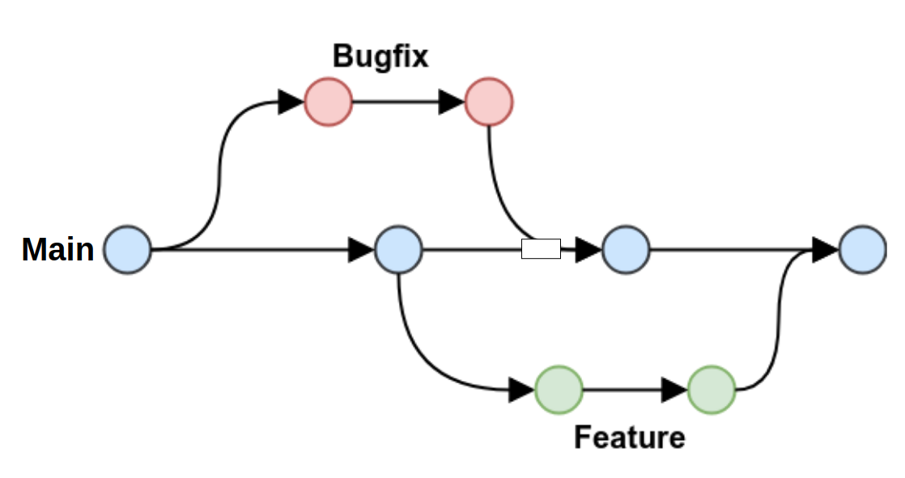

# 0005 - GitHub Flow P2023.1

ID: 12
Status: Concluído
Descrição: Construção da linha de trabalho no GIT
Data Entrega: 19/09/2023
DS - Projetos: [Projeto APP Comida Quente P2023.1](https://www.notion.so/Projeto-APP-Comida-Quente-P2023-1-6ccc249b1b134bf08eb5dfd40692e4dc?pvs=21)
Prioridade: Média
Próxima Tarefa: [0006 - Design Pattern Commit P2023.1](https://www.notion.so/0006-Design-Pattern-Commit-P2023-1-a844324c38364a3b96ec8e63ef0675b9?pvs=21)
Tarefa [Anterior: 0004 - Criar o ambiente virtual exclusivo para o projeto. P2023.1](https://www.notion.so/0004-Criar-o-ambiente-virtual-exclusivo-para-o-projeto-P2023-1-1f2c66586e6a4293ba62f054e74a18e4?pvs=21)

Utilizarei o processo mais simples, mantendo:

1. A Main como a única branch para homologação e produção. 
    1. Principal e constante
2. A Feature para o desenvolvimento de novas estruturas. A feture receberá o nome do que eu estiver implementando naquela hora, caso termine faço o merge na main e crio uma nova. 
    1. Secundária e variável.
3. A Bugfix ainda não sei como utilizar, até porque eu não vou mudar de branch só por causa de um “)” não fechado. Isso seria para um problema que eu não sei como resolver e mando para lá até resolver. Também receberá o nome do que eu estiver passando inseticida naquela hora, caso termine faço o merge na main e não crio uma nova.
    1. Secundária e variável.

